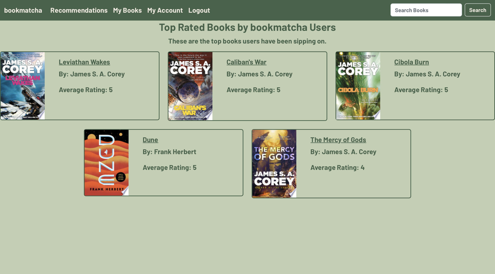
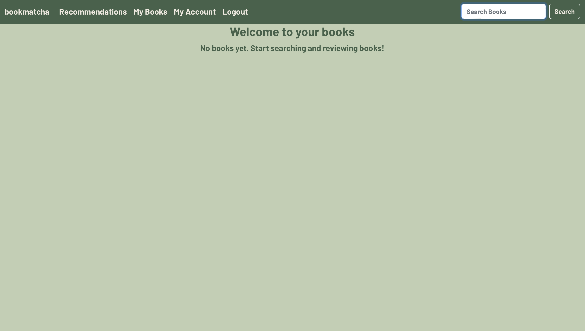
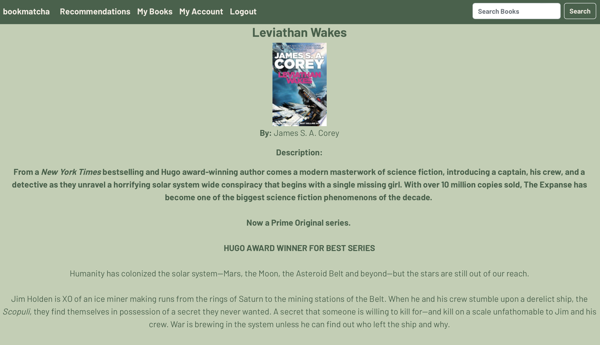

# bookmatcha

bookmatcha is a library application created using React for the front-end and Node.js and Express.js for the back-end, integrated with a MySQL database.
The library is made using books using the Google Books API. Users can search for books, write, edit, and delete reviews and give ratings to books, and view reviews written by other users. Users can get book recommendations based on what they have reviewed/rated.
User authentication was developed using JWT tokens and session state using localStorage. Books are added to a user's library when they give a review and rating for a book.

### Landing Page
This is the first page the user sees if they are not already logged in.
The user can login or register from here.

### Login
This is the form the user has to fill out to login.

### Register
This is the form the user has to fill out to register.

### Homepage 
When the user successfully logs in or registers, they will see this page once they enter bookmatcha.
Here they will see the top rated books by bookmatcha users.

### User's Books (Empty Library)
When the user has not reviewed/rated any books yet this what they will see.

### User's Books (Non-empty Library)
When the user has reviewed/rated books they can view their books here.
From this table, users can edit or delete their reviews/ratings here.

### Book Recommendations
### Non-empty 
If the user has reviewed/rated at least one book, then they can view books that are recommended to them.
Books are recommended based on books the user has given a rating of greater than or equal to three.

### Empty

### User Account
The user can change their first name, last name, or password on this page.

### Search Results
When a user searches for a book, this is how the results will be displayed to them.
The books are queried and shown for them using Google Books API.

### Book Details
When a user selects a book, these are the details of the book given. The details are fetched from Google Books This page is also where a user can write their own review and rating and look at reviews and ratings written by other users. If the user has already reviewed the book, they can edit their review and rating here.

